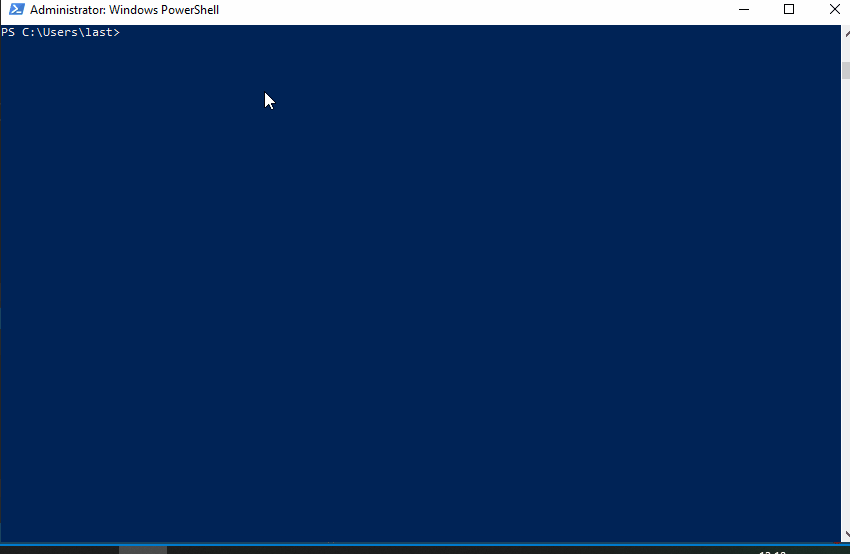

# DefenderSwitch
#### Stop Windows Defender using the Win32 API



### TL;DR
Even though Defender has a lot of fancy defensive features such as tamper protection, it can still be disabled with the following chain of actions:
1. become NT AUTHORITY\SYSTEM;
2. start the TrustedInstaller service and TrustedInstaller process;
3. impersonate TrustedInstaller;
4. open the WinDefend service and stop it;

DefenderSwitch does exactly that through the use of the Win32 API.

DefenderSwitch uses the standard Windows.h header and the WIL library. To install WIL use vcpkg:
```
C:\vcpkg> .\vcpkg.exe install wil:x86-windows
C:\vcpkg> .\vcpkg.exe install wil:x64-windows
```

### Usage

Spawn a cmd.exe as administrator, then:
```
C:\Users\last> .\DefenderSwitch.exe -off
C:\Users\last> .\DefenderSwitch.exe -on
```

### Opsec considerations  
This tool as it is written __is definetely not OPSEC safe__. Making it so is left as an exercise to the user :)
